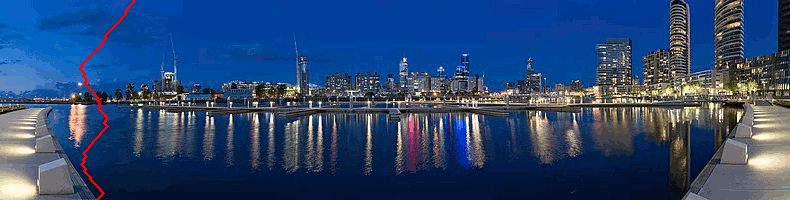

# Seam Carving
<p align="center">
  
</p>

## What
Seam carving is a method for implementing content-aware resizing or image retargeting. It aims to reduce the height or width of an image without losing information or altering the subject's proportions, major drawbacks of cropping and unlocking aspect-ratio respectively. 

## How
### Define and apply an energy function e(x, y) to an image.  
I decided to convert the image to greyscale and convole it with a LoG ([Laplacian of Gaussian](https://homepages.inf.ed.ac.uk/rbf/HIPR2/log.htm)) operator since it both reduces noise and detects edges, but a variety of other valid heuristics exist for doing the same (e.g. Sobel operator, magnitude difference between channels of neighboring pixels, etc.. While none are necessarily "correct", results will vary depending on your choice). I chose to handle the edge/border pixels with zero padding; again, other options exist for dealing with such cases. 

### Main loop
#### 1. Calculate the cumulative energy map  
Important to note that the term "seam" is used to convey that all pixels in one are connected; simply removing the min-energy value from each row would be would be useless in attempting to retain image features and could probably be better described as "speckle". That being said, sum the energy values of each pixel with the lowest energy value pixel directly above and adjacent to it(i.e. the north, north-west, and north-east pixels). For border pixels where neighboring pixels don't exist for one side, I chose the minimum of the two that were present. Pseudo code looks something like this, where sigma_e holds the result of accumulation:  
```
From each row in height:  
	sigma_e(row, col) = e(row, col) + min(e(row - 1, col - 1), e(row - 1, col), e(row - 1, col + 1)) 
```
Ex:
```
1 | 3 | 2	1 | 3 | 2  
_________	_________  
2 | 1 | 5 ----> 3 | 2 | 7  
_________	_________    
1 | 5 | 7	3 | 7 | 9
```

#### 2. Seam Removal
Now that we have sigma_e, we can find the start of the seam--this will be the pixel containing the lowest cumulative energy value in the bottom row. For each row we continue to traverse up and, with the previous seam index as a pivot, identify the neighboring pixel whose value minimizes sigma_e. We essentially use the same procedure as the pseudocode above, but identify the pixels in reverse row-order and save their locations as we go. Pseudo code:
```
//Identify start of seam  
row = height  
seam[row] = min(sigma_e(height, col = 0 to width))  

//Find the rest
From row = height to 1:  
	prev_col = seam[row]  
	seam[row - 1] = min(sigma_e(row - 1, prev_col - 1), sigma_e(row - 1, prev_col), sigma_e(row - 1, prev_col + 1))
```
Once the seam has been identified, remove it, taking care to exclude the pixel at seam locations.

#### 3. Update energy values along the seam
Each pixel along the seam has new neighbors, so their energy values are no longer accurate. To avoid recalculating the energy values at every pixel, I also remove the seam from the greyscale image I referenced when originally applying the LoG. Now I just recompute the convolution along each pixel cointained in the seam and update the original energies so they can be used to find sigma_e until all required seams are removed.  

## Drawbacks
Without image segmentation or consideration for edge gradient direction, removing too many seams from a "busy" picture is likely to result in output warped beyond recognition. I did include a masking tool to select portions of an image you'd like protected. Below is an example of the process with and w/o a mask:  

| Mask | No Mask | 
|:----------:|:----------:|
||| 

## Usage
Compile with makefile  
Requires CImg.h, ImageMagick for image types  

### Options

| command | description |
|:---:|:---:|
| -i | (char*) input path/to/image |
| -o | (char*) output path/to/save |
| -p | (int) percentage of image to resize by |
| -m | (bool) whether or not to apply mask |
